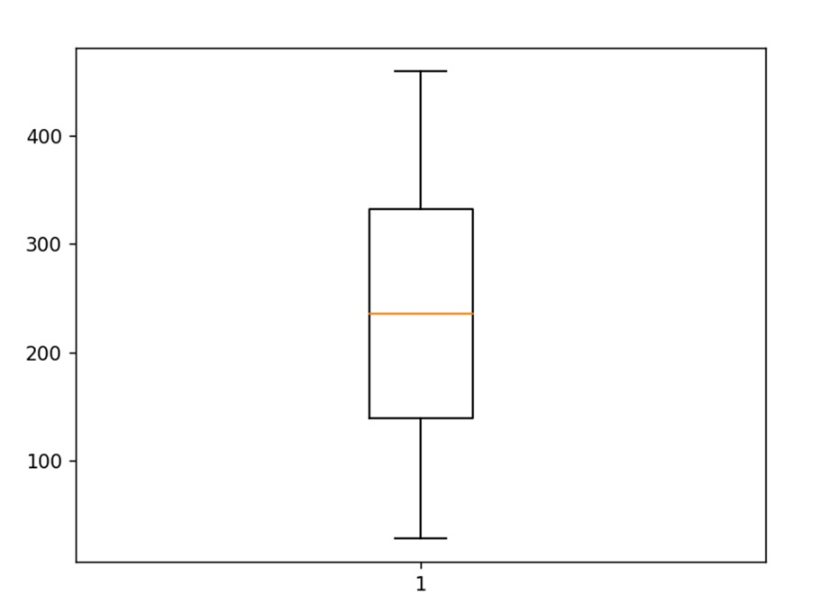
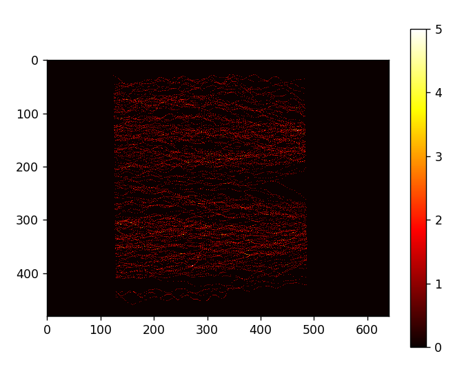

# Laboratorio 01: Cálculo de frecuencia peatonal 

## 1. Introducción

Tomando en consideración un contexto de las puertas del metro, se requiere una exploración del flujo de individuos a lo largo de pasillos y áreas de acceso unidireccional en el sistema del metro. El objetivo primordial es evaluar la dimensión de las entradas y salidas en un espacio determinado. Para tal fin, se propone la utilización de un archivo de texto en formato .txt, el cual registra de manera detallada el tránsito de personas a través de dicho espacio. Estos registros se encuentran expresados en coordenadas métricas, permitiendo una medición precisa en relación con la disposición física del área bajo análisis.

### 1.1 Justificación 

Comprender el flujo de personas en puntos críticos como las puertas del metro es crucial para la gestión del transporte urbano. El análisis de coordenadas de tránsito proporciona información precisa para tomar decisiones informadas en la asignación de recursos y en la mejora de la infraestructura, optimizando la eficiencia del sistema y enriqueciendo la experiencia de los usuarios.

### 1.3 Objetivos

**Objetivo General**
Evaluar las áreas de mayor tránsito de personas en base a la matriz de frecuencia obtenida.

**Objetivos específicos** 

1. Realizar la conversión de los valores de las coordenadas de metros a pixeles. 
2. Calcular la frecuencia de las coordenadas obtenidas.
3. Realizar una matriz de frecuencias en base a las coordenadas. 

## 2. Marco teórico
**IPython:** Una potente interfaz interactiva para Python enriquece la experiencia de programación al proporcionar un entorno interactivo.

**Visual Studio:** Es un entorno de desarrollo integrado potente y multifuncional. Reconocido por su capacidad para admitir múltiples lenguajes de programación, Visual brinda herramientas avanzadas para la creación, depuración y despliegue de aplicaciones. 

**NumPy:** Una librería fundamental en Python para cálculos numéricos y manipulación de matrices multidimensionales. Proporciona estructuras de datos eficientes y funciones matemáticas para realizar operaciones complejas con facilidad. NumPy es esencial para el procesamiento de datos en la investigación científica y el análisis de datos, al tiempo que optimiza el rendimiento computacional.

**Matplotlib:** Una librería gráfica en 2D que permite la visualización de datos y la creación de gráficos, compatible con diversos formatos. Su integración con NumPy lo convierte en una herramienta poderosa para crear visualizaciones en el análisis de datos.

## 3. Materiales y métodos

Los elementos para utilizar en el presente laboratorio corresponden principalmente a las coordenadas (X, Y,  Z) en metros como unidad de medida extraídas del conjunto de datos llamado "UNI_CORR_500_01.txt" y estas representan las unidades tridimensionales por las que las personas han pasado. Cada registro tiene información sobre las coordenadas X, Y y Z de la posición de una persona en un momento específico. Cabe recalcar que dentro del conjunto de datos existe el id de la persona que realiza la observación de las coordenadas a través de una cámara y el número de frame correspondiente. Este archivo contiene un total de 25.536 datos.

Específicamente, el experimento busca procesar las coordenadas capturadas por una cámara y determinar las coordenadas que tienen una mayor repetición. Este análisis nos permitirá identificar áreas de alta concentración de personas en el entorno monitoreado.
Es importante destacar que los resultados ofrecen valiosa información que se puede utilizar con distintos fines tales como la seguridad, optimización de espacios, gestión de multitudes y mejora de la experiencia del usuario. Estos resultados apoyan la toma de correctas decisiones para mejorar la eficiencia de la asignación de recursos y diseño de espacios, entre otros. 

Para realizar el análisis correcto de la base de datos y obtener los resultados esperados fue necesario realizar los siguientes pasos por medio de Visual Studio Code con la ayuda del lenguaje Python. 

1- Preparación del Entorno: Se abre el entorno de desarrollo, en este caso, Visual Studio Code y se importan las bibliotecas necesarias, como numpy y matplotlib, para el análisis y visualización de datos.

2- Lectura y Procesamiento de Datos: Se carga el archivo "UNI_CORR_500_01.txt" que contiene las coordenadas de las personas y se realiza la separación de los datos del archivo con el fin de crear listas separadas con los datos útiles.

3- Análisis de Frecuencias y varianzas: Se calcula la frecuencia de ocurrencia de las coordenadas X e Y utilizando diccionarios junto a sus varianzas.

4- Conversión a Píxeles: En base a funciones se convierten las coordenadas originales en metros a píxeles en ejes X e Y.

5- Conteo de Frecuencias de Coordenadas Convertidas: Se combinan las coordenadas convertidas en pares con el fin de obtener sus ocurrencias finales. 

6- Creación de Matriz de Frecuencias: Se crea una matriz de ceros que es posteriormente rellenada con las frecuencias obtenidas con el fin de la generación de un gráfico “mapa de calor”.

## 4. Resultados obtenidos
Segun los resultados obtenidos a partir de la eficiencia de los dos códigos realizados es correcto indicar que el código dos presenta una mayor rapidez y utiliza menos memoria. 

| Tipo de Experimento   | Tiempo de ejecución (mseg) |  Memoria utilizada (Mb) |
|-----------------------|----------------------------|-------------------------|
| Programa Uno (p01.py) |   0.5901 segundos          |    22085632 bytes       |
| Programa Dos (p02.py) |   0.0832 segundos          |    5300.0    KB         |

  <figcaption>Tabla 1: Tipo de experimentos</figcaption>

La varianza refleja la dispersión de los datos con relación al promedio, lo cual es esencial en este caso para evaluar el uso completo de la puerta y su área circundante. Una alta varianza indica una amplia dispersión de los datos, lo que sugiere una ocupación efectiva de las dimensiones disponibles para el paso.

<figure>
  
  <figcaption>Ilustración 1: Diagrama de caja</figcaption>
</figure>

Al considerar el promedio en cada coordenada, según se evidencia en el diagrama de caja, podemos inferir que la varianza es alta en la coordenada y. Esto implica que la mayoría del espacio para el paso está siendo aprovechado, ya que los datos se extienden ampliamente. En contraste, en la coordenada x, la varianza es menor en relación con los píxeles. Aunque esto podría deberse a la conversión de datos de metros a píxeles, la varianza sigue siendo considerable. 

| Tipo de Experimento   |          Varianza          |  Desviación estándar    |
|-----------------------|----------------------------|-------------------------|
| Coordenada "X"        |         10488.1153         |        102.4115         |
| Coordenada "Y"        |         12128.9924         |        110.1317         |
| Coordenada "X,Y"      |         12405.6039         |        111.3804         |

  <figcaption>Tabla 2: Varianzas</figcaption>

A continuación se muestran los resultados obtenidos a partir de la matriz de frecuencias realizada. 

<figure>
  
  <figcaption>Ilustración 2: Mapa de calor</figcaption>
</figure>

Optimización del Espacio: El patrón de dispersión inicial podría ayudar a aprovechar de manera eficiente el espacio disponible en los lados del pasillo, lo que permite acomodar a más personas en una zona más amplia. A medida que las personas se mezclan en el centro, se adapta al flujo de dirección única y optimiza el uso del espacio compartido.

Concluyendo, al analizar detenidamente el video que ilustra el flujo de personas a lo largo del corredor con anchos B1 = 1,00 y B2 = 5,00 metros, se puede inferir que el patrón de separación inicial en la matriz de calor se debe a la presencia de un obstáculo en el centro del pasillo. Este obstáculo parece estar obstruyendo el paso y es responsable del comportamiento observado en la distribución de las personas.

<figure>
  
  <figcaption>Ilustración 3: Transeúntes</figcaption>
</figure>

## 5. Conclusiones

El primer código presenta un enfoque detallado y explicativo en sus operaciones, lo que puede ser beneficioso para comprender paso a paso. Sin embargo, utiliza bucles “for” en varias operaciones, lo que podría ser menos eficiente en términos de tiempo de ejecución. Además, algunos cálculos se duplican en diferentes partes del código, lo que podría dificultar el mantenimiento. Por otro lado, el segundo código es más eficiente y organizado. Utiliza funciones y comprensiones de lista para modularizar y simplificar el código. Aunque podría ser menos claro debido a la falta de comentarios y la estructura más compacta, mide el tiempo y la memoria de manera más precisa y presenta un enfoque más orientado a la optimización y modularidad. En resumen, el segundo código es preferible en términos de eficiencia y organización, mientras que el primer código podría ser útil en un contexto educativo debido a su enfoque detallado.

Es relevante destacar la eficiente utilización del espacio en el corredor, donde no se observan aglomeraciones, insinuando que el área destinada al tránsito de personas está bien dimensionada y se emplea de manera práctica. Aunque se utiliza casi en su totalidad, no se registra un uso excesivo, indicado por la relativa ausencia de ocupación en los extremos.

Por otro lado, al analizar las medidas de las puertas de entrada y salida es útil para explicar el flujo reducido de personas, se sugiere que en caso de querer aumentar el flujo de personas se aumente la dimensión de la entrada B1.

