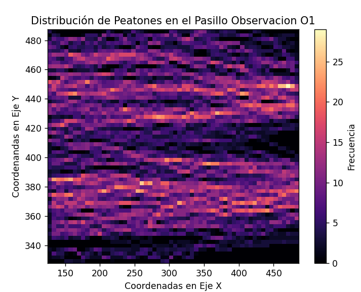
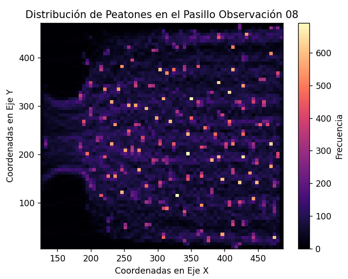
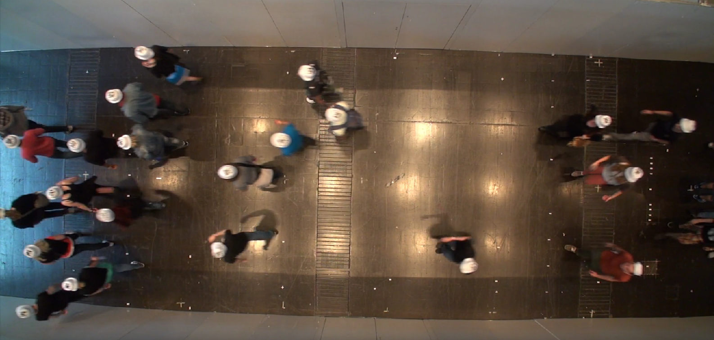
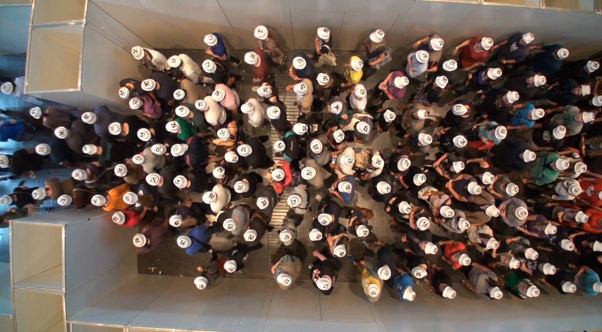

# Laboratorio 02: Cálculo de frecuencia peatonal 

## 1. Introducción

Tomando en consideración un contexto del ancho de las puertas de entrada y salida, se requiere una exploración del flujo de individuos a lo largo de pasillos y áreas de acceso unidireccional. El objetivo primordial es evaluar la dimensión de las entradas y salidas en un espacio determinado junto a las diferentes eficiencias de códigos que permitirían esta evaluación. Para tal fin, se propone la utilización de dos archivos de texto en formato .txt, que contienen registros que se encuentran expresados en coordenadas métricas, permitiendo una medición precisa en relación con la disposición física del área bajo análisis.

### 1.1 Justificación 

Comprender el flujo de personas en puntos críticos como por ejemplo en las puertas del metro ya que es crucial para la gestión del transporte urbano. El análisis de coordenadas de tránsito peatonal proporciona información precisa para tomar decisiones informadas en la asignación de recursos y en la mejora de la infraestructura, optimizando la eficiencia del sistema y enriqueciendo la experiencia de los usuarios.

### 1.3 Objetivos

**Objetivo General**
Evaluar los resultados obtenidos de las implementaciones de los códigos a partir de su eficiencia.

**Objetivos específicos** 

1. Realizar la conversión de los valores con la librería Pandas.
2. Realizar un mapa de calor a partir de las coordenadas entregadas.
3. Analizar el comportamiento del flujo de personas.

## 2. Marco teórico
**IPython:** Una potente interfaz interactiva para Python enriquece la experiencia de programación al proporcionar un entorno interactivo.

**Visual Studio:** Es un entorno de desarrollo integrado potente y multifuncional que se utiliza en el presente laboratorio. Visual brinda herramientas avanzadas para la creación, depuración y despliegue de aplicaciones. 

**NumPy:** Una librería fundamental en Python que se utiliza para cálculos numéricos y manipulación de matrices multidimensionales. Es esencial para el procesamiento de datos en la investigación científica y el análisis de datos, al tiempo que optimiza el rendimiento computacional.

**Matplotlib:** Esta librería se usará para la visualización de datos y la creación de gráficos. Su integración con NumPy lo convierte en una herramienta poderosa para crear visualizaciones en el análisis de datos.

**Pandas:** Es una librería de Python para análisis de datos. Ofrece estructuras flexibles como Series y Data Frames, facilitando la carga, limpieza y manipulación eficiente de datos. Es esencial en ciencia de datos y tareas de procesamiento de información.

## 3. Materiales y métodos

Los elementos para utilizar en el presente laboratorio corresponden principalmente a las coordenadas (X, Y,  Z) en metros como unidad de medida extraídas de los conjuntos de datos llamado "UNI_CORR_500_01.txt" y "UNI_CORR_500_08.txt", estas coordenadas representan las unidades tridimensionales por las que las personas han pasado. Cada registro tiene información sobre las coordenadas X, Y y Z de la posición de una persona en un momento específico. Cabe recalcar que dentro del conjunto de datos existe el id de la persona que realiza la observación de las coordenadas a través de una cámara y el número de frame correspondiente. Este archivo contiene un total de 25.536 datos.

Específicamente, el experimento busca procesar las coordenadas capturadas por una cámara y reflejar estas coordenadas en pixeles para obtener gráficos que permitan analizar el comportamiento de las personas en un entorno monitoreado. Es importante destacar que los resultados ofrecen valiosa información que apoyan la toma de correctas decisiones para mejorar la eficiencia de la asignación de recursos y diseño de espacios, entre otros. 

Para realizar el análisis correcto de la base de datos y obtener los resultados esperados fue necesario realizar los siguientes pasos por medio de Visual Studio Code con la ayuda del lenguaje Python. 

1- Preparación del Entorno: Se abre el entorno de desarrollo, en este caso, Visual Studio Code y se importan las bibliotecas necesarias, como numpy y matplotlib, pandas, time, psutil, para el análisis y visualización de datos.

2- Medición Inicial de Memoria y Tiempo: Se utiliza psutil para medir la memoria utilizada en el sistema antes de la ejecución del código, y time para medir el tiempo de inicio de la ejecución.

3- Lectura y Procesamiento de Datos: Se carga el archivo "UNI_CORR_500_01.txt" y "UNI_CORR_500_08.txt" que contienen las coordenadas de las personas para la creación de un data frame a través de pandas, para una mejor visualización y limpieza de los encabezados de la tabla.

4-Manipulación de Datos y Visualización: Se realiza una serie de operaciones en ambos data frames, ya que se crea nuevas columnas XPIXEL y YPIXEL basadas en cálculos de las columnas existentes. Se crea una figura con un histograma bidimensional (hist2d) que representa la distribución de peatones en un pasillo. Los datos utilizados son las columnas XPIXEL y YPIXEL.

5- Medición de Tiempo y Memoria Utilizada: Después de la visualización, se registra el tiempo de finalización de la ejecución y se calcula el tiempo transcurrido con time y psutil. También se mide la memoria utilizada después de la ejecución.

6- Visualización de Gráficos y Resultados: Se utilizó plt.show() para mostrar los gráficos generados en las secciones anteriores. Además, se imprime el tiempo de ejecución y la memoria utilizada en la consola con el fin de comparar la eficiencia con el laboratorio número 1.

## 4. Resultados obtenidos
según los resultados obtenidos a partir de la comparación de la metodología usada en el Código del laboratorio 1 con respecto a la metodología con el uso de la librería Pandas en el laboratorio 2 se obtuvieron los siguientes resultados:

| Tipo de Experimento      | Tiempo de ejecución (mseg) |  Memoria utilizada (Mb) |
|--------------------------|----------------------------|-------------------------|
| Laboratorio Uno (p01.py) |      8257.00 mseg          |      40.13 Mb           |
| Laboratorio Dos (p02.py) |      571.03  mseg          |      47.64 Mb           |

  <figcaption>Tabla 1: Comparación de experimentos</figcaption>

El funcionamiento de ambos códigos es correcto pero es evidente que el laboratorio dos es muchos más rápido que el laboratorio número uno, esto es debido a que las librerías permiten realizar en menos líneas de Código las acciones necesarias para evaluar los archivos. 

En la ilustración 1 se pueden ver los resultados obtenidos en el laboratorio dos en el archivo TXT "UNI_CORR_500_01" gracias a la librería Pandas y a la conversión de datos a un data frame que contiene las coordenadas de X e Y.

<figure>
  
  <figcaption>Ilustración 1: Mapa de calor observación 01</figcaption>
</figure>

En la ilustración 2 se muestran los resultados obtenidos en el laboratorio dos en el archivo TXT "UNI_CORR_500_08" gracias a la librería Pandas y a la conversión de datos a un data frame que contiene las coordenadas de X e Y.

<figure>
  
  <figcaption>Ilustración 2: Mapa de calor observación 08</figcaption>
</figure>

Optimización del Espacio: El patrón de dispersión inicial de la ilustración 1, podría ayudar a aprovechar de manera eficiente el espacio disponible en los lados del pasillo dado su flujo de personas continua con respecto al espacio, lo que permite acomodar a más personas en una zona más amplia. A medida que las personas se mezclan en el centro, se adapta al flujo de dirección única y optimiza el uso del espacio compartido.

La ilustración 2 muestra una dispersión más concentrada, lo cual puede indicar que hay una mayor aglomeración de personas. Esta aglomeración sugiere que los usuarios podrían estar experimentando dificultades al moverse entre sí, ya que el espacio se vuelve más limitado. Desde el inicio del pasillo, el área está completamente ocupada y luego se reduce gradualmente a medida que se acerca a la segunda puerta. Esto resulta en una disminución en el espacio disponible para las personas al final del pasillo.

Al analizar detenidamente la Ilustración 3 extraída del video con el flujo de personas a lo largo del corredor con una entrada B1 = 1,00 y salida B2 = 5,00 metros, es válido inferir que el flujo de personas es rápido y bajo debido a las medidas de entrada, además, cabe recalcar que las personas se separan al inicio del pasillo debido a un obstáculo en ese sector. 

<figure>
  
  <figcaption>Ilustración 3: Transeúntes 01</figcaption>
</figure>

Por último, al examinar la ilustración 4 que representa el flujo de personas en un pasillo con una entrada de 5,00 metros (B1) y una salida de 2,00 metros (B2), resulta evidente que el flujo de individuos se detiene. Esta situación se debe al hecho de que la salida, siendo más estrecha que la entrada, crea un cuello de botella en el flujo, resultando en una marcada aglomeración de personas.

<figure>
  
  <figcaption>Ilustración 4: Transeúntes 08</figcaption>
</figure>

## 5. Conclusiones

Ambos códigos realizan tareas muy similares, pero la diferencia principal radica en la estructura y las técnicas utilizadas para lograr esos resultados.

El código del laboratorio 2 utiliza Pandas para cargar y manipular los datos, y aprovecha las operaciones vectorizadas de NumPy para realizar cálculos eficientes en bloques. Esto hace que el código sea más eficiente en términos de tiempo de ejecución y uso de memoria, ya que Pandas y NumPy están optimizados para operaciones de datos.

Además de la eficiencia, es más legible porque utiliza funciones para abstraer tareas y aprovecha las funcionalidades de Pandas y NumPy. Esto hace que el código sea más fácil de entender y mantener, y sigue prácticas de programación más modernas.

Por otro lado, en el código del laboratorio 1 se utiliza un enfoque más manual, utilizando bucles explícitos para manipular y analizar los datos del archivo de texto. Este código no hace uso de las bibliotecas Pandas ni de las operaciones vectorizadas de NumPy.

Este enfoque podría resultar menos eficiente en términos de tiempo de ejecución y uso de memoria debido al uso de bucles explícitos para muchas tareas. Además, la legibilidad del código puede verse comprometida debido a la necesidad de escribir bucles y operaciones de manera repetitiva.

Por lo cual, si el objetivo es lograr eficiencia y legibilidad, el código del segundo laboratorio es una mejor elección debido a su uso de bibliotecas optimizadas y enfoque modular. Sin embargo, el código del primer laboratorio podría tener méritos si se busca utilizar la programación en términos mas simples de estructura, debido a esto produce que sus tiempos de ejecuciones sean más extensos y radicaría problemas en la depuración, ya que un código tan extenso puede producir confusión al momento de comprenderlo.

En resumen, se puede afirmar que se ha alcanzado exitosamente el objetivo general del estudio, que consistía en realizar una evaluación adecuada de los resultados obtenidos. Además, en relación con los objetivos específicos, se ha logrado una efectiva utilización de la librería Pandas, combinada con la creación de mapas de calor mediante Matplotlib, para llevar a cabo un análisis exhaustivo del comportamiento de los transeúntes.

