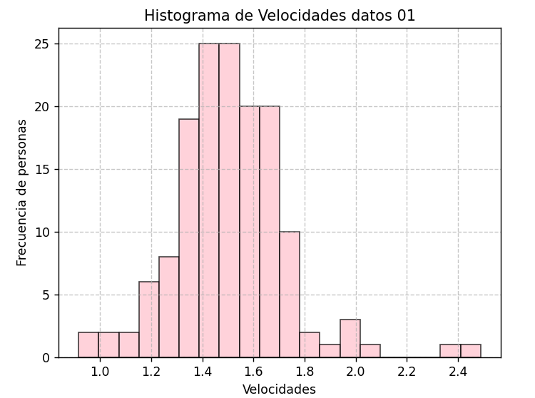
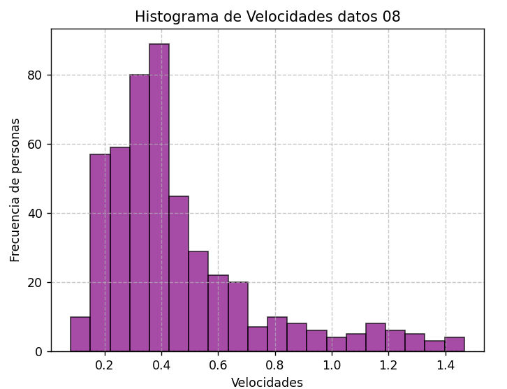
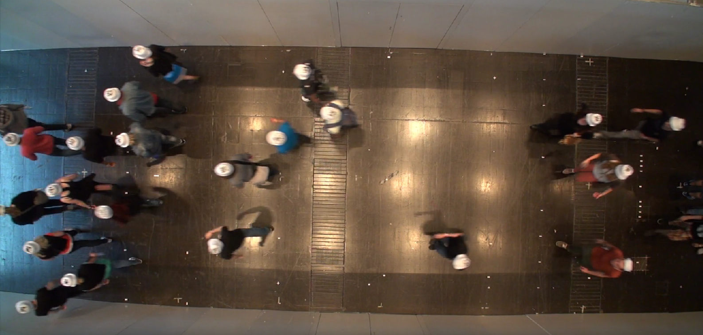
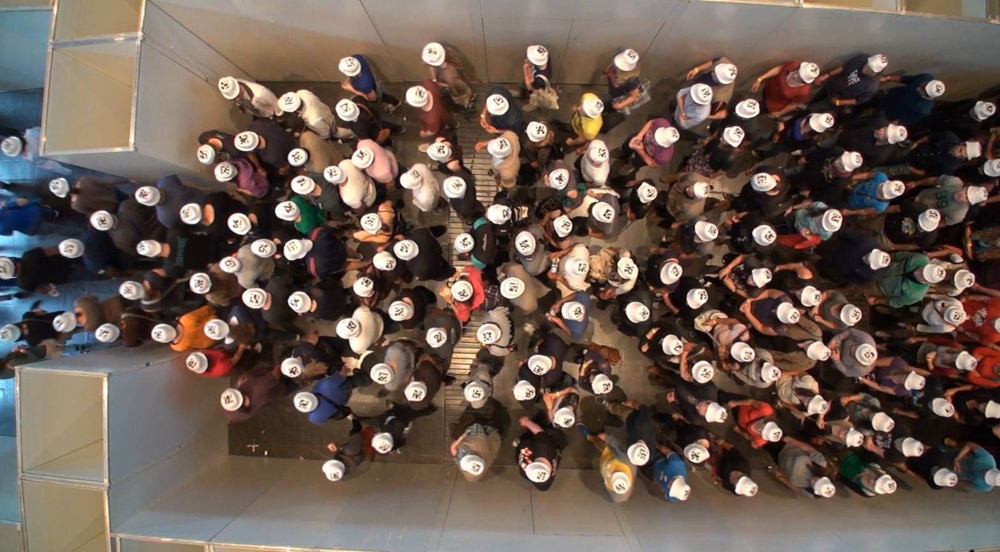

# Laboratorio 03: Cálculo de frecuencia peatonal 

## 1. Introducción

Tomando en consideración un contexto del ancho de las puertas de entrada y salida, se requiere una exploración del flujo de individuos a lo largo de pasillos y áreas de acceso unidireccional. El objetivo primordial es evaluar la dimensión de las entradas y salidas en un espacio determinado. Para tal fin, se propone la utilización de dos archivos de texto en formato .txt, que contienen registros que se encuentran expresados en coordenadas métricas, permitiendo una medición precisa en relación con la disposición física del área bajo análisis.

### 1.1 Justificación 

Comprender el flujo de personas en puntos críticos como por ejemplo en las puertas del metro ya que es crucial para la gestión del transporte urbano. El análisis de coordenadas de tránsito peatonal proporciona información precisa para tomar decisiones informadas en la asignación de recursos y en la mejora de la infraestructura, optimizando la eficiencia del sistema y enriqueciendo la experiencia de los usuarios.

### 1.3 Objetivos
### Objetivo General
Obtener las distintas velocidades correspondientes a cada peatón. 

### Objetivos específicos 

1. Analizar el comportamiento de los peatones en base a sus velocidades promedio. 
2. Realizar un histograma con el fin de observar los resultados obtenidos.
3. Calcular las métricas correspondientes para complementar el análisis. 

## 2. Marco teórico
**IPython:** Una potente interfaz interactiva para Python enriquece la experiencia de programación al proporcionar un entorno interactivo.

**Visual Studio:** Es un entorno de desarrollo integrado potente y multifuncional que se utiliza en el presente laboratorio. Visual brinda herramientas avanzadas para la creación, depuración y despliegue de aplicaciones. 

**NumPy:** Una librería fundamental en Python que se utiliza para cálculos numéricos y manipulación de matrices multidimensionales. Es esencial para el procesamiento de datos en la investigación científica y el análisis de datos, al tiempo que optimiza el rendimiento computacional.

**Matplotlib:** Esta librería se usará para la visualización de datos y la creación de gráficos. Su integración con NumPy lo convierte en una herramienta poderosa para crear visualizaciones en el análisis de datos.

**Pandas:** Es una librería de Python para análisis de datos. Ofrece estructuras flexibles como Series y Data Frames, facilitando la carga, limpieza y manipulación eficiente de datos. Es esencial en ciencia de datos y tareas de procesamiento de información.

**Time:** Es utilizada para medir el tiempo de ejecución del código.

**Psutil:** Se utiliza para obtener información del sistema, como la memoria utilizada.

## 3. Materiales y métodos
Los elementos para utilizar en el presente laboratorio corresponden principalmente a las coordenadas (X, Y,  Z) en metros como unidad de medida extraídas de los conjuntos de datos llamado "UNI_CORR_500_01.txt" y "UNI_CORR_500_08.txt", estas coordenadas representan las unidades tridimensionales por las que las personas han pasado. Cada registro tiene información sobre las coordenadas X, Y, Z de la posición de una persona en un momento específico. Cabe recalcar que dentro del conjunto de datos existe el id de la persona que realiza la observación de las coordenadas a través de una cámara y el número de frame correspondiente. El archivo 01 contiene más de veinticinco mil datos, y el archivo 08 más de trescientos sesenta mil.

Específicamente, el experimento busca procesar las coordenadas capturadas por una cámara y reflejar estas coordenadas en pixeles para obtener gráficos que permitan analizar el comportamiento de las personas en un entorno monitoreado. Es importante destacar que los resultados ofrecen valiosa información que apoyan la toma de correctas decisiones para mejorar la eficiencia de la asignación de recursos y diseño de espacios, entre otros. 

Para realizar el análisis correcto de la base de datos y obtener los resultados esperados fue necesario realizar los siguientes pasos por medio de Visual Studio Code con la ayuda del lenguaje Python. 

1- Importar las librerías necesarias tales como Pandas o Time para medir el rendimiento del código.

2- Se importan los archivos CSV ("UNI_CORR_500_01.txt" y "UNI_CORR_500_08.txt") que son almacenados en data frames por separado.

3- Se crea una función que calcula la velocidad de cada peatón diferenciado por su ID, basándose en las diferencias en las coordenadas X e Y con respecto a la fórmula de distancia euclidiana en un plano bidimensional agregando a un nuevo data frame las columnas "Distancia", "tiempo" y "Velocidad".

4- Se crean data frames en base a la agrupación de los id de cada peatón con un group by, y a cada uno se le aplica la  función que calcula la velocidad a cada grupo de datos del respectivo peatón analizado, todos los datos se almacenan en un Data frame distinto al original.

5- Se calcula la velocidad promedio por persona con un group by por id de la persona y se calcula el promedio con la función mean de pandas a las velocidades de cada persona.

6- En base a las velocidades promedio de cada persona se crea un histograma con las velocidades y las cantidades de personas que siguen esta velocidad. 

7- Mide el tiempo de ejecución transcurrido y la memoria utilizada en el Código. 

## 4. Resultados obtenidos
En la tabla 1 se pueden observar los resultados obtenidos con respecto al Código utilizado en este laboratorio el cual cuenta con funciones de la librería pandas, funciones para calcular la velocidad de las personas, entre otros. 

|       Experimento        | Tiempo de ejecución (mseg) |  Memoria utilizada (Mb) | 
|--------------------------|----------------------------|-------------------------|
| Laboratorio (p01.py)     |      1347.311 mseg         |      43.64 Mb           |

  <figcaption>Tabla 1: Medidas de desempeño </figcaption>

A continuación, en la tabla 2 se presentan los resultados obtenidos con respecto a las distintas velocidades que presenta cada peatón en los diferentes TXT. 

Al comparar las métricas entre la Observación 01 y la Observación 08, se pueden observar algunas diferencias significativas en términos de velocidad y variabilidad. En la Observación 01, la velocidad promedio es considerablemente mayor en comparación con la Observación 08. La velocidad máxima también es más alta en la Observación 01, lo que sugiere momentos de mayor aceleración o velocidad pico en comparación con la Observación 08, de hecho, en esta ultima es posible intuir que existen aglomeraciones. 

En cuanto a la variabilidad, la varianza en la Observación 08 es mayor en comparación con la Observación 01, por lo que indicaría que existe un factor que posiblemente afecte en el avance de los peatones por el sector. 

|       Tipo         |      Observación 01       |     Observación 08      | 
|--------------------|---------------------------|-------------------------|
| Velocidad promedio |      1.4742 mt/seg        |      0.3616 mt/seg      |
| Velocidad Máxima   |      2.4883 mt/seg        |      1.4672 mt/seg      |
| Velocidad Mínima   |      0.9167 mt/seg        |      0.0801 mt/seg      |
| Varianza           |      0.0488 mt/seg        |      0.0762 mt/seg      |

  <figcaption>Tabla 2: Métricas del experimento</figcaption>

En la ilustación 01 se encuentran las distintas velocidades de cada uno de los peatones del archivo TXT "UNI_CORR_500_01" presentadas por un histograma, cada una se las velocidades están en el eje horizontal y la cantidad de personas que siguen las distintas velocidades están en el eje vertical. La mayoría de los peatones siguen velocidades entre 1.3 y 1.7 metros por segundo.

<figure>
  
  <figcaption>Ilustración 1: Histograma de velocidades observación 01</figcaption>
</figure>

En la ilustración 2 se muestran los resultados obtenidos en el archivo TXT "UNI_CORR_500_08" con los que se construyó un histograma como el mostrado anteriormente. En este caso la mayoría de las personas siguen velocidades ente las 0.2 y 0.6 metros por hora.

<figure>
  
  <figcaption>Ilustración 2: Histograma de velocidades observación 08</figcaption>
</figure>

Corroborando lo anterior: 
Al examinar detenidamente la Ilustración 3, obtenida del video que muestra el flujo de personas a lo largo de un corredor con una entrada en B1 de 1,00 metro y una salida en B2 de 5,00 metros, es posible deducir que el flujo de personas es rápido y de baja densidad debido a las medidas de entrada. Además, es importante destacar que al inicio del pasillo las personas se separan debido a la presencia de un obstáculo en esa área. Cabe mencionar que, en este flujo, se registra la entrada de 148 personas en el cual ninguno se detiene durante el tránsito, solo se mantiene la velocidad debido a las personas más cercanas. Igualmente, no existe algún problema que produzca un cuello de botella, por lo cual es un paso de manera expedita.

<figure>
  
  <figcaption>Ilustración 3: Transeúntes 01</figcaption>
</figure>

Finalmente, al analizar la Ilustración 4, que ilustra el flujo de personas en un pasillo con una entrada de 5,00 metros (B1) y una salida de 2,00 metros (B2), es claramente evidente que el flujo de individuos se detiene por completo. Esta situación se origina debido a que la salida, al ser más estrecha que la entrada, genera un efecto de cuello de botella en el flujo, lo que resulta en una aglomeración significativa de personas en ese punto. Entran 477 personas para el análisis del experimento, demostrando los significativos problemas que se puede obtener dado las dimensiones de las puertas de un pasillo debido a la aglomeración de las personas ante cualquier situación de estas albergaduras.

<figure>
  
  <figcaption>Ilustración 4: Transeúntes 08</figcaption>
</figure>

## 5. Conclusiones
Para el análisis detallado de las dimensiones de las puertas en un pasillo unidireccional revela una conexión intrínseca entre la eficiencia del flujo de personas y el diseño espacial. La comparación entre las situaciones representadas en las ilustraciones 3 y 4 demuestra cómo el ancho de las entradas y salidas desempeña un papel fundamental en la regulación del tránsito de personas.

La ilustración 3 enfatiza cómo una entrada más amplia en comparación con la salida permite un flujo más fluido y rápido de personas, lo que minimiza la aglomeración y mejora la experiencia del usuario. Por otro lado, la ilustración 4 ilustra el efecto contrario, donde una salida más estrecha crea un cuello de botella que detiene el flujo y genera congestión. 

Esto no necesariamente indica que manera es mejor que otra, ya que todo depende del contexto que se ubique el problema del flujo de personas, ya que se tiene que tomar en cuenta tanto el flujo, como el costo de llevar a cabo ciertas dimensiones.

Esto subraya la importancia de considerar cuidadosamente las dimensiones de las puertas en el diseño y planificación de sistemas en el flujo de personas. Un diseño equilibrado, que tenga en cuenta tanto la entrada como la salida, puede contribuir significativamente a la eficiencia operativa, la seguridad y la comodidad de los usuarios. En última instancia, reconocer la influencia de las dimensiones de las puertas es esencial para crear un ambiente más eficiente y satisfactorio para la población urbana en constante crecimiento.

En resumen, los objetivos planteados en este estudio se lograron de manera satisfactoria. A través del análisis de las velocidades promedio de los peatones, se obtuvo una comprensión clara de su comportamiento en el entorno estudiado. La creación del histograma permitió visualizar de manera efectiva los resultados, ofreciendo una representación gráfica de las distintas velocidades observadas. Además, el cálculo de métricas complementarias enriqueció aún más el análisis, brindando una perspectiva completa de las tendencias de velocidad entre los peatones. 

